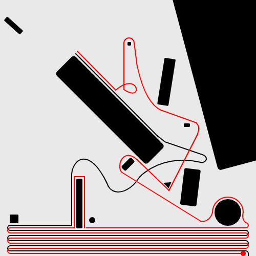

># Assignment_day 1

## _The emotion i tried to represent is_ **love**.

I wanted to capture the mysterious nature of love and the journey it takes, within the bewildering maze of our society. The two lines represented in the illustration, **the red curve** and the **black curve** is the representation of the journey of two people.

Sometimes the lines intersect, sway and wander to life and all its predicaments , nevertheless love has the power to find its way through it all.

The lines (journey of two people), starts out at the bottom of the screen. We can see the structured, monotonous, cyclic nature of both the curve's, which conveys the mundane rhythmic nature of their lives. But on a few occasions these lines intersect and their paths cross, over time they dance to the spell of love. This new found emotion and the innocence of it, has the ability to break free from the mundane and kindle new mutual experiences, breaking free from the cyclic nature before.

But society is not too forgiving, it's conditioned to suppress the nature of love. In the context of this illustration, the big (and small) back polygons and circles represent the obstacles that the two paths must overcome. They wander through this maze, sometimes desolate and aimless. But through the struggles that society conditions the two paths make it through all and unite as one.

## _In the lense of the_ **code**.

The composition mainly consits majorly of Arcs, lines, rectangles and bezier curves.
I found a neat trick to help connect the curves and lines, since the program runs on a co-ordinate system it was hard to calculate the coordinates of each pixel and replicate my organic sketch.

>**text (mouseX(/ and mouse Y),x,y)**, in draw helped with the problem. now I can hover my mouse on any pixel on the canvas to reference its coordinates and adjust my curves and bezier accordingly as per my sketch. 

