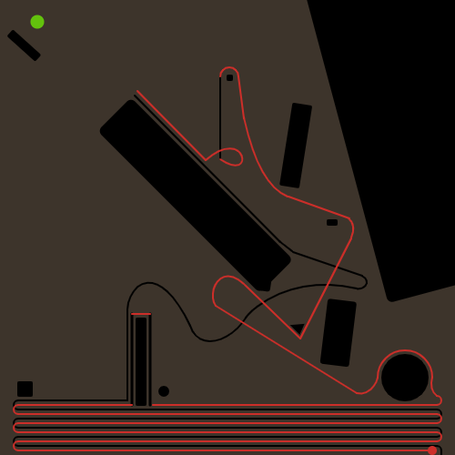

># Assignment_day 2_Transition from love to disgust. 

## _**Transitioning from my previous illustration about love to disgust.**_ 

I tried to capture the emotions of love to disgust through the color transitions, by interacting with the mouse. Similar to the story of my first illustration about love, the player transitions by hovering the mouse over the path the lovers take, as he does the color in the background changes from lighter more happier tones to darker more grim tones of green shades, indicating the subtleties and more complex nature of love. 

