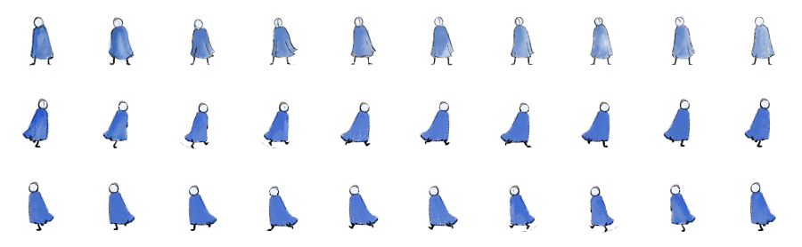

# Assignment_day 5 - 30 Seconds Interactive Game.

## _Title_ - Trial of the night.

The Trial of the Night is a game about a bad dream in which the player is having a conversation with his inner voice, the happy man (the overman) and his conscious self (reflected by the player's action). The game talks about darker themes of desire and overcoming your fears. The "overman" as coined by the German philosopher Friedrich Nietzsche - talks about it  as a goal for humanity to strive for, representing a being who overcomes traditional morality and creates their own values and meaning in life. Key aspects include self-creation, the complete affirmation of life, and the rejection of external authority like religion or social norms, which is often illustrated metaphorically as the transformation from a camel to a lion to a child.

I find the overman concept very interesting, and wanted players to experience what Nietzsche is talking about. The experience is put in a narrative form by setting the story in a trial within the player's dream. The happy man (the overman) - is the judge of this domain/trail who is overlooking the player and the action he takes. There are also these other voices in the background (the inner voice) which is integral to the narrative experience, these voices (the inner voice) which can be good or bad, keep whispering to the player as he progresses though the level, planting the seeds of thoughts and doubts in the players mind.

> ## _Designing and animating my character._

Since the player is playing as the character in his dream space, I wanted the design of the character to not have a head to symbolize the dream-like world.I wanted the rough lines to be spoken through the animation, the squiggly style represents the mental state of my character, phasing in and out of his beliefs. The robe signifies the cold depths of the realm he is in, also makes the animation much simpler to execute. 

> ## _The structure._

The Narrative experience, in my first design had a branch structure where the players start in the intro game level, from there depending on the path taken the player can disclose the story in two narrative paths. But I soon realized that coding a level structure like that involves a lot more complexity, thus I had to dial back and choose a linear narrative structure where my player starts in the intro level and as he traverses through the level (in one direction in this case the right) he progresses through the narrative. 

> ## _The code._

The major thing that I had to explore in the code was understanding gamestates and levels, as I had to make the player progress through the game in a linear fashion from level 1 to level 6 (the end screen). For the game states I have used an array to hold my strings, and based on the location of the character x position in the screen, the game state will switch. 

I have used the map function to slowly fade in the text as my player progresses through the levels symbolizing his inner voice. This was done by mapping the player x position to the alfa value of the text shown, that way the text will fade in as the player moves though the screen. 

> I used AI on the following things,
> - into screen to level 1 - sound play back loop.
> - Adding a poem in my end screen was also quite tricky. though in hind sight I think the Ai over complicated the process.
> - understanding logical NOT operators - was very hany when it came to sound. 

> Things i messed up in the code,
> - I ended up hard coding the player y, and npc y along with the Image sizes - as per by window width and height/ in my chrome browser. Which ended up being a big mistake.

^^ I will have to fix this mistake in my future build. 

link to final assignment assignment,
> https://anshulshetty82-dotcom.github.io/NID_Anshul_P5.JS/Day5_Assignment_10.10.25/Assignment_1%20(new%2010%20print%20pattern)/

