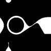

## Assignment_day 3

# _Making my pattern for 10print._

I tried to capture the essence of oil spilt on water for the pattern. The goal was to capture its organic flow, with the 10 print generative piece.

Regarding the construction of the pattern. on each piece of tile 4 points have been marked. The points are similar in all the other tiles, so that when the code randomly generates the order of tiles, the patter connects seamlessly across the canvas.

# _learnings_

I feel like the outcome didn't come out to be how i imagined it. The 10print generated with the pattern looked very structured contrary to how I perceived the pattern to be.

