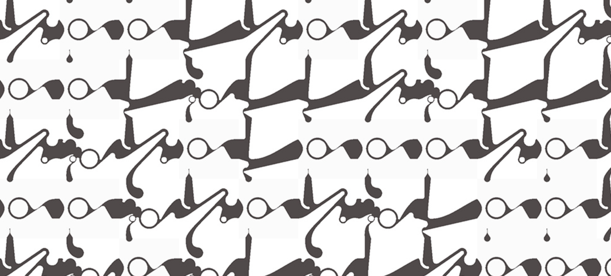

## Assignment_day 4 - Load images using arrays.

I've used the same pattern used in the previous assignment, but in this one I tried to tweak the colors highlighting the path and not the background.

# _learnings_

It was much easier to load the images using the array function, saving a lot of time especially if the project has multiple image files.

link to day 4 assignment,
> https://anshulshetty82-dotcom.github.io/NID_Anshul_P5.JS/Day4_Assignment_09.10.25/Assignment_1(10%20print_ARRAY)/
