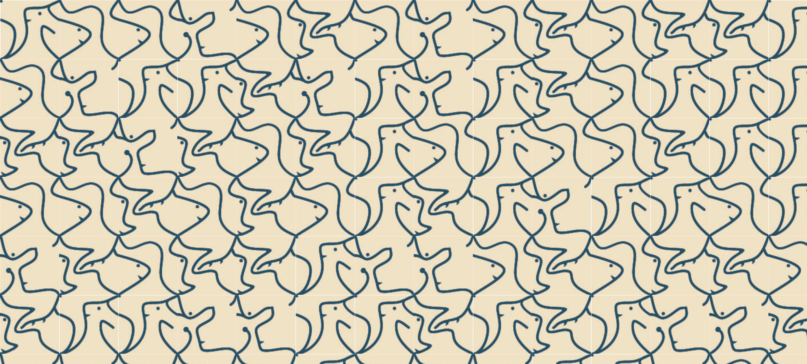

## Assignment_day 5 - New 10 print.

For this attempt I looked at illustrating abstract wildlife with the generative 10print pattern. This time to make the art feel a bit more organic, I connected the diagonals of each square and two other points on the vertices. The four tiles represent one animal like rabbit, fish, horse and a mole, inspired from a book I read recently called the boy, the mole, the fox and the horse.

for the color palette I looked into neutral beige tones, taking inspiration from children's books.

link to day 5_1st assignment,
> https://anshulshetty82-dotcom.github.io/NID_Anshul_P5.JS/Day5_Assignment_10.10.25/Assignment_1%20(new%2010%20print%20pattern)/
